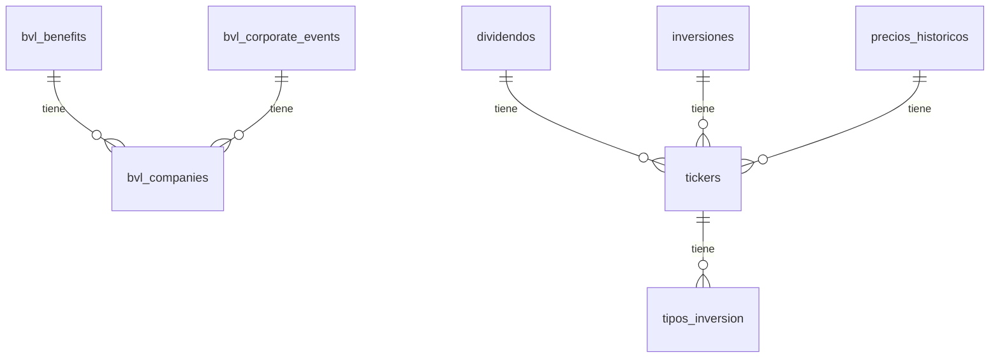

# Esquema de Base de Datos - Sistema de Inversiones

Generado: 8/1/2026, 10:20:55 a. m.

## Índice

- [bvl_benefits](#tabla-bvl_benefits)
- [bvl_companies](#tabla-bvl_companies)
- [bvl_corporate_events](#tabla-bvl_corporate_events)
- [dividendos](#tabla-dividendos)
- [inversiones](#tabla-inversiones)
- [portfolio_evolucion_diaria](#tabla-portfolio_evolucion_diaria)
- [precios_historicos](#tabla-precios_historicos)
- [presupuesto](#tabla-presupuesto)
- [sqlite_sequence](#tabla-sqlite_sequence)
- [tickers](#tabla-tickers)
- [tipos_cambio](#tabla-tipos_cambio)
- [tipos_inversion](#tabla-tipos_inversion)

---

## Diagrama Entidad-Relación

---

## Tabla: `bvl_benefits`

| Columna | Tipo | Null | Default | PK |
|---------|------|------|---------|----|
| `id` | INTEGER | YES | - | ✓ |
| `rpj_code` | TEXT | NO | - |  |
| `ticker` | TEXT | YES | - |  |
| `isin` | TEXT | YES | - |  |
| `value_type` | TEXT | YES | - |  |
| `benefit_type` | TEXT | YES | - |  |
| `amount` | REAL | YES | - |  |
| `currency` | TEXT | YES | - |  |
| `record_date` | TEXT | YES | - |  |
| `payment_date` | TEXT | YES | - |  |
| `ex_date` | TEXT | YES | - |  |
| `created_at` | TEXT | YES | CURRENT_TIMESTAMP |  |

### Relaciones (Foreign Keys)

- `rpj_code` → `bvl_companies(`rpj_code`)`

### Índices

- **idx_bvl_benefits_rpj** (INDEX): `rpj_code`

---

## Tabla: `bvl_companies`

| Columna | Tipo | Null | Default | PK |
|---------|------|------|---------|----|
| `rpj_code` | TEXT | YES | - | ✓ |
| `company_name` | TEXT | NO | - |  |
| `sector_code` | TEXT | YES | - |  |
| `sector_description` | TEXT | YES | - |  |
| `stock` | TEXT | YES | - |  |
| `indices` | TEXT | YES | - |  |
| `updated_at` | TEXT | YES | CURRENT_TIMESTAMP |  |

---

## Tabla: `bvl_corporate_events`

| Columna | Tipo | Null | Default | PK |
|---------|------|------|---------|----|
| `id` | TEXT | YES | - | ✓ |
| `rpj_code` | TEXT | NO | - |  |
| `business_name` | TEXT | YES | - |  |
| `event_date` | TEXT | YES | - |  |
| `register_date` | TEXT | YES | - |  |
| `session` | TEXT | YES | - |  |
| `event_types` | TEXT | YES | - |  |
| `documents` | TEXT | YES | - |  |
| `created_at` | TEXT | YES | CURRENT_TIMESTAMP |  |

### Relaciones (Foreign Keys)

- `rpj_code` → `bvl_companies(`rpj_code`)`

### Índices

- **idx_bvl_events_rpj** (INDEX): `rpj_code`, `event_date`

---

## Tabla: `dividendos`

| Columna | Tipo | Null | Default | PK |
|---------|------|------|---------|----|
| `id` | INTEGER | YES | - | ✓ |
| `ticker_id` | INTEGER | NO | - |  |
| `fecha` | TEXT | NO | - |  |
| `monto` | NUMERIC(14,6) | NO | - |  |
| `moneda` | TEXT | NO | - |  |
| `created_at` | TEXT | NO | datetime('now') |  |
| `mercado` | TEXT | YES | - |  |

### Relaciones (Foreign Keys)

- `ticker_id` → `tickers(`id`)`

### Índices

- **idx_dividendos_fecha** (INDEX): `fecha`
- **idx_dividendos_ticker_id** (INDEX): `ticker_id`

---

## Tabla: `inversiones`

| Columna | Tipo | Null | Default | PK |
|---------|------|------|---------|----|
| `id` | INTEGER | YES | - | ✓ |
| `ticker_id` | INTEGER | NO | - |  |
| `fecha` | TEXT | NO | - |  |
| `importe` | NUMERIC(14,2) | NO | - |  |
| `cantidad` | NUMERIC(14,6) | NO | - |  |
| `apertura_guardada` | NUMERIC(14,6) | NO | - |  |
| `plataforma` | TEXT | YES | - |  |

### Relaciones (Foreign Keys)

- `ticker_id` → `tickers(`id`)`

### Índices

- **idx_inversiones_unique** (UNIQUE): `ticker_id`, `fecha`, `importe`, `cantidad`, `plataforma`
- **idx_inversiones_ticker_fecha** (INDEX): `ticker_id`, `fecha`

---

## Tabla: `portfolio_evolucion_diaria`

| Columna | Tipo | Null | Default | PK |
|---------|------|------|---------|----|
| `fecha` | TEXT | NO | - | ✓ |
| `inversion_usd` | NUMERIC(14,2) | NO | 0 |  |
| `balance_usd` | NUMERIC(14,2) | NO | 0 |  |
| `rendimiento_usd` | NUMERIC(14,2) | NO | 0 |  |
| `rentabilidad_porcentaje` | NUMERIC(8,4) | NO | 0 |  |
| `updated_at` | TEXT | NO | datetime('now') |  |

### Índices

- **idx_portfolio_evolucion_fecha** (INDEX): `fecha`

---

## Tabla: `precios_historicos`

| Columna | Tipo | Null | Default | PK |
|---------|------|------|---------|----|
| `id` | INTEGER | YES | - | ✓ |
| `ticker_id` | INTEGER | NO | - |  |
| `fecha` | TEXT | NO | - |  |
| `precio` | NUMERIC(14,6) | NO | - |  |
| `fuente_api` | TEXT | YES | - |  |
| `updated_at` | TEXT | NO | - |  |

### Relaciones (Foreign Keys)

- `ticker_id` → `tickers(`id`)`

### Índices

- **idx_precios_ticker_fecha** (INDEX): `ticker_id`, `fecha`

---

## Tabla: `presupuesto`

| Columna | Tipo | Null | Default | PK |
|---------|------|------|---------|----|
| `id` | INTEGER | YES | - | ✓ |
| `nombre` | TEXT | NO | - |  |
| `version` | TEXT | NO | - |  |
| `created_at` | TEXT | NO | - |  |

---

## Tabla: `sqlite_sequence`

| Columna | Tipo | Null | Default | PK |
|---------|------|------|---------|----|
| `name` |  | YES | - |  |
| `seq` |  | YES | - |  |

---

## Tabla: `tickers`

| Columna | Tipo | Null | Default | PK |
|---------|------|------|---------|----|
| `id` | INTEGER | YES | - | ✓ |
| `ticker` | TEXT | NO | - |  |
| `nombre` | TEXT | NO | - |  |
| `moneda` | TEXT | NO | - |  |
| `tipo_inversion_id` | INTEGER | NO | - |  |
| `estado` | TEXT | YES | 'activo' |  |
| `exchange` | TEXT | YES | - |  |
| `rpj_code` | TEXT | YES | - |  |

### Relaciones (Foreign Keys)

- `tipo_inversion_id` → `tipos_inversion(`id`)`

### Índices

- **idx_tickers_rpj_code** (INDEX): `rpj_code`

---

## Tabla: `tipos_cambio`

| Columna | Tipo | Null | Default | PK |
|---------|------|------|---------|----|
| `id` | INTEGER | YES | - | ✓ |
| `fecha` | TEXT | NO | - |  |
| `usd_pen` | NUMERIC(14,6) | NO | - |  |
| `fuente_api` | TEXT | YES | - |  |

---

## Tabla: `tipos_inversion`

| Columna | Tipo | Null | Default | PK |
|---------|------|------|---------|----|
| `id` | INTEGER | YES | - | ✓ |
| `nombre` | TEXT | NO | - |  |
| `activo` | INTEGER | NO | 1 |  |
| `descripcion` | TEXT | YES | - |  |

---

